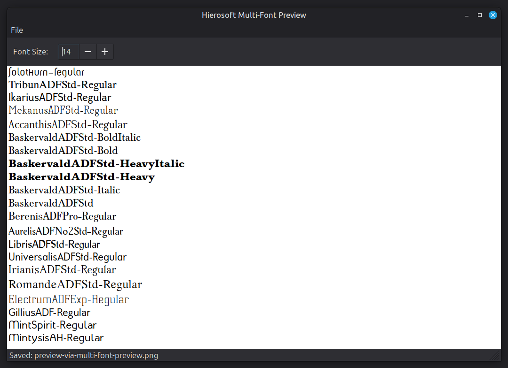

# multi-font-preview
Preview an entire folder of fonts, zipped or not.

Example (opening my entire folder of files downloaded from <https://arkandis.tuxfamily.org/adffonts.html>):

If "Regular..." checkbox is checked, and a folder/ZIP contains a font with "Regular" (or "-R") in the name, only that font will be used. This is useful in cases where there are multiple font subfolders, and you want to only show the regular version of each.
